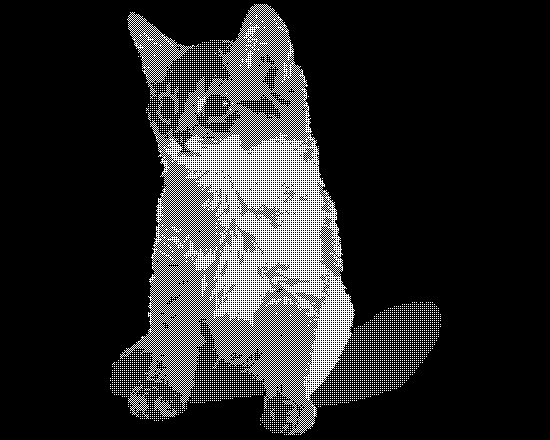

# Ditherpunk

Ce projet est un outil de traitement d'images qui applique divers algorithmes de dithering et de diffusion d'erreurs pour convertir des images en versions avec moins de couleurs, tout en conservant l'apparence visuelle aussi proche que possible de l'original.

## Fonctionnalités

- **Alternance de pixels blancs** : Alterne les pixels blancs dans l'image.
- **Seuil** : Convertit l'image en noir et blanc en utilisant un seuil spécifié.
- **Palette** : Réduit l'image à une palette de couleurs spécifiée.
- **Dithering** : Applique un algorithme de dithering basique.
- **Dithering ordonné** : Applique un algorithme de dithering ordonné avec une matrice spécifiée.
- **Diffusion d'erreurs** : Applique des algorithmes de diffusion d'erreurs tels que Floyd-Steinberg, Jarvis-Judice-Ninke et Atkinson.

## Installation
Clonez le dépôt et compilez le projet en utilisant Cargo :
```bash
git clone https://github.com/MelchorRuiz/Ditherpunk.git
cd Ditherpunk
cargo build --release
```

## Utilisation
Le programme s'exécute depuis la ligne de commande et accepte plusieurs modes de fonctionnement, chacun avec ses propres paramètres.

### Exemple d'utilisation

```bash
# Alternance de pixels blancs
./target/release/Ditherpunk input.png white_pixel_alternation 
# Seuil
./target/release/Ditherpunk input.png seuillage --couleur-claire white --couleur-foncee black
# Palette
./target/release/Ditherpunk input.png palette -n 8
# Dithering
./target/release/Ditherpunk input.png tramage 
# Dithering ordonné
./target/release/Ditherpunk input.png tramage-ordonne -n 1
# Diffusion d'erreurs
./target/release/Ditherpunk input.png diffusion-erreur --algorithme floyd_steinberg
```

### Exemples de Résultats

| Algorithme | Avant | Après | 
| :-: | :-: | :-: |
| alternance-pixels-blancs |  |  |
| seuillage |  |  |
| palette |  |  |
| tramage |  |  |
| tramage-ordonne |  |  |
| diffusion-erreur |  |  |

## Questions

### Question 2

**On obtient un DynamicImage, à quoi correspond ce type?**<br>
Rgba8

**Comment obtenir une image en mode rbg8 à partir de ce DynamicImage?**<br>
```img.to_rgb8();```

### Question 3
**Que se passe-t-il si l’image de départ avait un canal alpha?**<br>
Tous les pixels transparents deviennent noirs, comme le montre l'exemple suivant

| Avant | Après | 
| :-: | :-: |
|  |  |

### Question 9
**Comment calculer la distance entre deux couleurs?**<br>
J'ai utilisé une méthode mathématique qui mesure la différence entre les deux couleurs dans l'espace colorimétrique tridimensionnel, appelée **distance euclidienne**.

Formule de la distance euclidienne<br>
Si les deux couleurs sont représentées par :
- ( C_1 = (R_1, G_1, B_1) )
- ( C_2 = (R_2, G_2, B_2) )

Alors, la distance \( D \) entre ces deux couleurs est donnée par :

D = √ (R_2 - R_1)^2 + (G_2 - G_1)^2 + (B_2 - B_1)^2

### Question 11
**Comportement avec une palette vide**<br>
Le programme renvoie une erreur si le nombre de couleurs à utiliser est inférieur ou égal à 0 ou s'il est supérieur à 8.

### Question 17
**Comment l'erreur commise dans chaque pixel est représentée et distribuée.**<br>
Pour un pixel RGB ( c_original = (r, g, b) ), l'erreur est ( e(x, y) = (r - r_q, g - g_q, b - b_q) ), où ( c_quantifié v) est la couleur quantifiée. Cette erreur est diffusée aux pixels voisins selon une matrice (ex. Floyd-Steinberg), ajustant leurs valeurs avant quantification pour un rendu plus fidèle.
